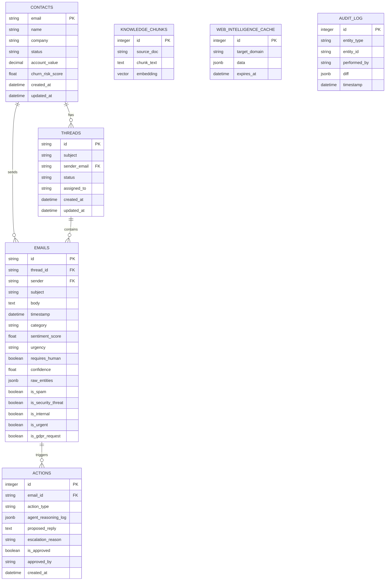

# SenAI CRM Entity-Relationship Diagram

```mermaid
erDiagram
    CONTACTS {
        string email PK
        string name
        string company
        string status
        decimal account_value
        float churn_risk_score
        datetime created_at
        datetime updated_at
    }

    THREADS {
        string id PK
        string subject
        string sender_email FK
        string status
        string assigned_to
        datetime created_at
        datetime updated_at
    }

    EMAILS {
        string id PK
        string thread_id FK
        string sender FK
        string subject
        text body
        datetime timestamp
        string category
        float sentiment_score
        string urgency
        boolean requires_human
        float confidence
        jsonb raw_entities
        boolean is_spam
        boolean is_security_threat
        boolean is_internal
        boolean is_urgent
        boolean is_gdpr_request
    }

    ACTIONS {
        integer id PK
        string email_id FK
        string action_type
        jsonb agent_reasoning_log
        text proposed_reply
        string escalation_reason
        boolean is_approved
        string approved_by
        datetime created_at
    }

    KNOWLEDGE_CHUNKS {
        integer id PK
        string source_doc
        text chunk_text
        vector embedding
    }

    WEB_INTELLIGENCE_CACHE {
        integer id PK
        string target_domain
        jsonb data
        datetime expires_at
    }

    AUDIT_LOG {
        integer id PK
        string entity_type
        string entity_id
        string performed_by
        jsonb diff
        datetime timestamp
    }

    CONTACTS ||--o{ THREADS : "has"
    CONTACTS ||--o{ EMAILS : "sends"
    THREADS ||--o{ EMAILS : "contains"
    EMAILS ||--o{ ACTIONS : "triggers"
```
